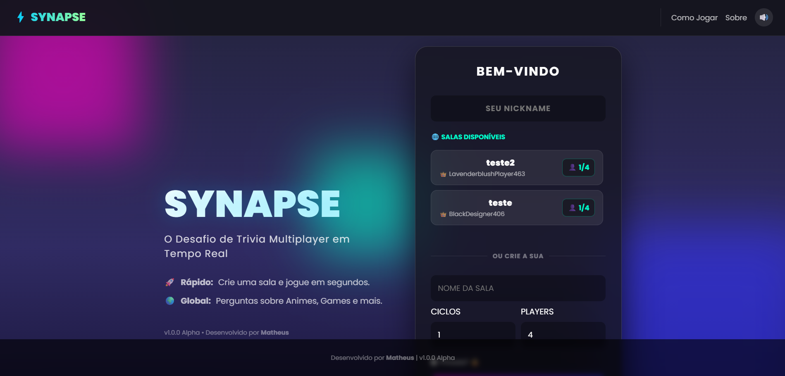
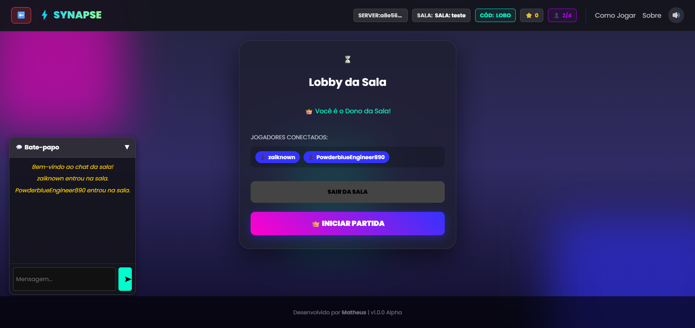
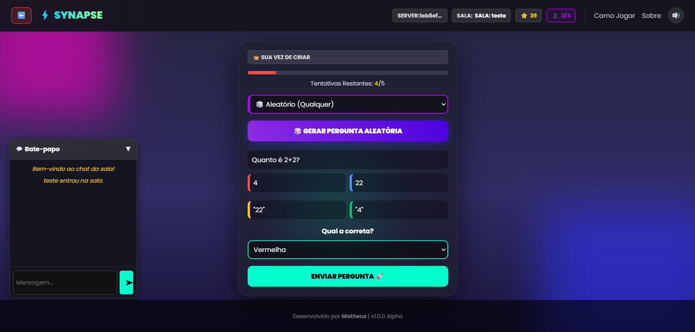
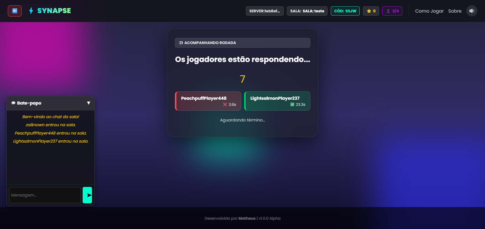
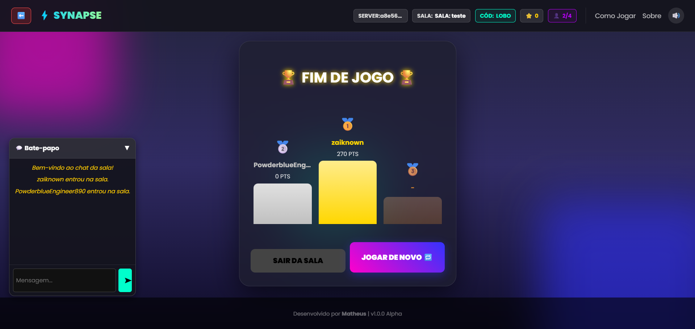

# 🧠 Synapse - Multiplayer Trivia Game

> Conecte-se. Crie. Responda. O Quiz Multiplayer em Tempo Real onde você controla o jogo.


## Sobre o Projeto

**Synapse** é um jogo de perguntas e respostas (Trivia) focado na interação rápida e fluida. Diferente de jogos tradicionais, aqui a dinâmica é rotativa: a cada rodada, um jogador se torna o **Mestre (Criador)** e deve formular uma pergunta para testar a agilidade mental dos outros participantes.

O projeto foi construído com foco em **performance (WebSockets)**, **escalabilidade (Redis/Docker Swarm)** e uma interface **Neon/Cyberpunk**.

---

## 🖼️ Galeria

| Tela Inicial | Lobby de Espera |
| :---: | :---: |
|  |  |

| Tela do Criador | Tela de Resposta |
| :---: | :---: |
|  |  |

| Pódio Final |
| :---: |
|  |

---

## Funcionalidades Principais

### Gameplay Dinâmica
* **Sistema de Rodadas:** O papel de "Criador da Pergunta" passa de jogador para jogador automaticamente.
* **Feedback Instantâneo:** Pontuação, acertos e erros são mostrados em tempo real.
* **Podium Final:** Ranking animado ao final dos ciclos.

### Mecânicas Inteligentes
* **Anti-AFK:** O servidor monitora o tempo. Se o criador não enviar a pergunta em 45 segundos, o sistema gera uma pergunta automática.
* **Gestão de Salas:** Se a sala ficar com menos de 2 jogadores durante a partida, ela é encerrada automaticamente.
* **Reconexão Inteligente:** Se você der F5 ou cair a internet, o jogo te coloca de volta na sala exatamente onde você estava.

### UX & Interface
* **Nicks Aleatórios Globais:** O sistema gera nicks estilo *Gamer* (ex: `NeonSniper99`, `BlueAgent42`) usando a biblioteca `Faker` (en_US).
* **Chat Draggable:** Um chat em tempo real que pode ser minimizado ou **arrastado para qualquer lugar da tela** (funciona no PC e Celular).
* **Design Responsivo:** Interface "Glassmorphism" que funciona perfeitamente em Desktop e Mobile.

---

## Tech Stack

### Backend
* **[FastAPI](https://fastapi.tiangolo.com/):** Framework moderno e assíncrono para gerenciar os WebSockets.
* **[Redis](https://redis.io/):** Banco de dados em memória para gerenciar o estado das salas e sincronia com alta performance.
* **[Faker](https://faker.readthedocs.io/):** Geração de identidades fictícias.
* **Python `asyncio`:** Gerenciamento de timers e tarefas em background.

### Frontend
* **Vanilla JS:** Lógica pura e leve, sem frameworks pesados.
* **CSS3 Moderno:** Flexbox, Grid e Efeitos de Vidro (Glassmorphism).
* **WebSockets:** Comunicação bidirecional nativa.

### Infraestrutura
* **Docker & Docker Compose:** Containerização completa.
* **Docker Swarm:** Orquestração para escalabilidade horizontal (réplicas).

---

## Como Rodar o Projeto

### Pré-requisitos
* [Docker](https://www.docker.com/) instalado.

### Passo a Passo

1.  **Clone o repositório:**
    ```bash
    git clone https://github.com/Zaiknown/synapse.git
    cd synapse
    ```
    
2.  **Construa a Imagem (Build):**
    ```bash
    docker build -t synapse-img:v1 .
    ```

3.  **Suba o Cluster (Deploy):**
    ```bash
    docker stack deploy -c docker-compose.yml synapse_stack
    ```

4.  **Acesse o jogo:**
    Abra seu navegador em: `http://localhost`

### Comandos Úteis

* **Parar o servidor:**
  ```bash
  docker stack rm synapse_stack
  ```

* **Ver logs em tempo real:**
  ```bash
  # Veja o que está acontecendo nos containers do jogo
  docker service logs -f synapse_stack_game-node
  ```

* **Atualizar após mudança no código:**
  Sempre que alterar um arquivo `.py` ou instalar uma lib nova, rode:
  ```bash
  docker build -t synapse-img:v1 .
  docker stack deploy -c docker-compose.yml synapse_stack
  ```

---

## 📂 Estrutura do Projeto

A organização das pastas segue o padrão MVC simplificado para FastAPI:

```bash
synapse/
├── app/
│   ├── main.py              # Entrada da aplicação (Inicia o FastAPI)
│   ├── game.py              # Lógica principal do WebSocket (Game Loop)
│   ├── dependencies.py      # Conexão centralizada com Redis
│   ├── routers/             # Rotas HTTP (Public, Admin, API)
│   └── services/            # Integrações externas (Trivia API)
├── static/
│   ├── script.js            # Lógica do Cliente (Front-end Vanilla)
│   ├── style.css            # Estilização (Glassmorphism & Responsividade)
│   └── sounds/              # Efeitos sonoros (SFX)
├── templates/               # Arquivos HTML (Jinja2)
│   ├── index.html           # Layout Principal
│   └── components/          # Fragmentos de UI (Creator, Chat, Lobby)
├── Dockerfile               # Configuração da imagem Python
├── docker-compose.yml       # Orquestração (App + Redis)
└── requirements.txt         # Dependências do Python
```

---

## 🤝 Contribuindo

Contribuições são bem-vindas! Se você tiver uma ideia legal para melhorar o **Synapse**:

1.  Faça um **Fork** do projeto.
2.  Crie uma **Branch** para sua Feature (`git checkout -b feature/NovaFeature`).
3.  Faça o **Commit** (`git commit -m 'Add NovaFeature'`).
4.  Faça o **Push** (`git push origin feature/NovaFeature`).
5.  Abra um **Pull Request**.

---

## 📝 Licença

Este projeto está sob a licença MIT. Sinta-se livre para usar, estudar e modificar.

---

<p align="center">
  Feito com 🧠 por <strong>Matheus</strong>
</p>
